How to make an attractive GitHub repo
=====================================

A guide for [CIS 565](http://www.seas.upenn.edu/~cis565/) students by [Patrick Cozzi](http://www.seas.upenn.edu/~pcozzi/).

A good README.md
----------------

Presenting your work well is at least as important as the quailty of the work itself.  The web is full of noise and visitors will quickly move on if you do not grab their attention immediately.

Do not keep the original `README.md` with our project instructions.  Instead, completely rewrite it so introduces your project to a technical hiring manager or developer.  Remember, things that are obvious to you might not be obvious to them so provide enough background and context.

### Representitive image

The `README.md` should start with a title, followed by your name (with a link to your website, twitter, blog, etc. with your contact info), and then a representitive image of your work.  Including an image like this has been tradition in SIGGRAPH and many other graphics venues for years.  Here's some good examples:

   * [GPU-Accelerated Dynamic Fracture in the Browser](https://github.com/kainino0x/cis565final) by Jiatong He and Kai Ninomiya
   * [Surface Mesh Reconstruction from RGBD Images](https://github.com/cboots/RGBD-to-Mesh) by Collin Boots and Dalton Banks
   * [Accelerated Stochastic Progressive Photon Mapping on the GPU](https://github.com/ishaan13/PhotonMapper) by Ishaan Singh, Yingting Xiao, and Xiaoyan Zhu
   
Here's the photon mapping image:

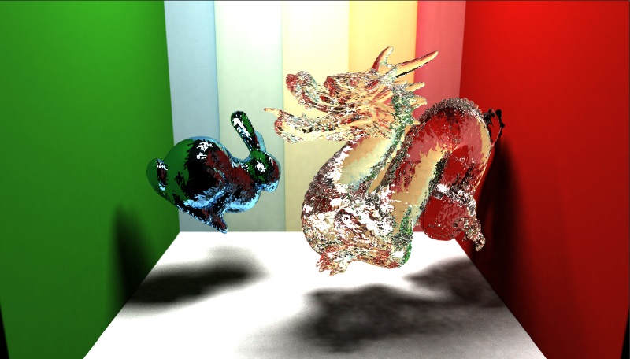

The image should be representitive in that it highlights the breadth and depth of your work.  It should be your favorite showpiece.  Make sure the resolution is reasonable so it downloads quickly.  Do not use bmp files; use png or jpg.

### Features screenshots

Show.  Don't tell.

Use screenshots with captions to build up the features in your project.  For example, see:

* [Interactive Real-Time WebGL Fluid](https://github.com/dblsai/WebGL-Fluid) by Binglu Du and Xingjie Ma

Each feature is highlighted with a screenshot (animated gifs actually work quite well for this project).  Scroll down more to the `Water Simulation` section where they introduce the components of the fluid simulation with screenshots starting with just the height map and then building up to object interaction with the surface.

The representitive image for [Surface Mesh Reconstruction from RGBD Images](https://github.com/cboots/RGBD-to-Mesh) also nicely builds up its features:

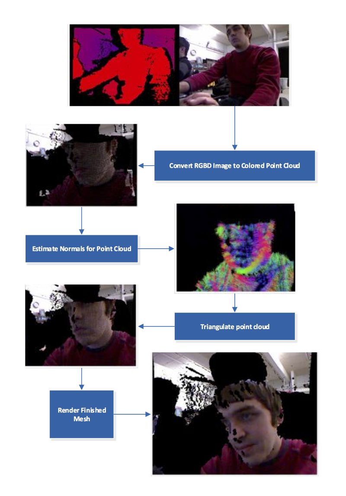

### Annotate

In addition to screenshots that break down each feature, it is illustrative to annoate a representitive image, perhaps even _the_ representitive image.  Point out each feature like Kai Ninomiya did in his [GPU path tracer](https://github.com/kainino0x/Project3-Pathtracer):

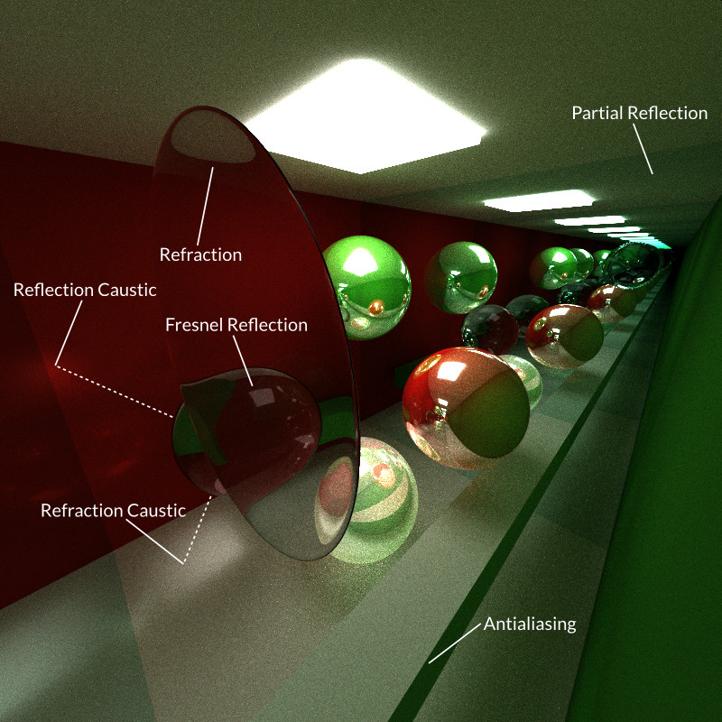

I know the caustics and Fresnel are obvious to you, but they are not obvious to everyone.

### Debug screenshots

Debug views are useful for development, but are also _really useful_ to help explain how your project works.  A few good examples are:

* [GPU Ray Tracer](https://github.com/cboots/Project1-RayTracer) by Collin Boots
* [Deferred Shader](https://github.com/otaku690/GLSLDeferredShading) by Cheng-Tso Lin
* [Uniform grid and kd-tree in CUDA](https://github.com/jeremynewlin/Accel) by Jeremy Newlin and Danny Rerucha

In Collin's ray tracer, the following screenshots show distance to the closest surface, normals, and oversampling.

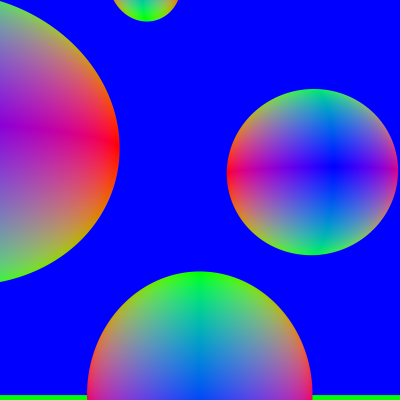
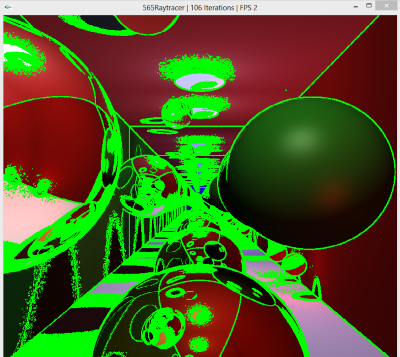

For a deferred shader, it is insightful to show each g-buffer like, for example, the depth and normal buffers in Cheng's deferred shader:

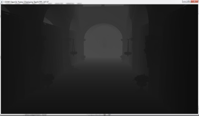
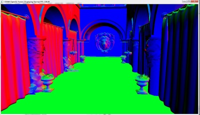

For some projects, the only visual output will be debug views.  For example, in Jeremy and Danny's spatial data structure project, this screenshot shows nearest neighbor search.

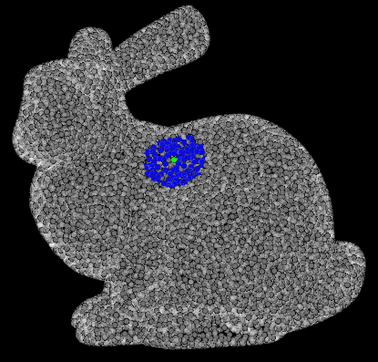

### Side-by-side comparisions

It is instructive to highlight features by showing side-by-side screenshots, one with the feature and one without.  Some good examples are:

* [Deferred Shader](https://github.com/cboots/Deferred-Shading) by Collin Boots
* [GPU Path Tracer](https://github.com/foxking0416/Project3-Pathtracer) by Wei-Chien Tu

Here's the bump maping screenshots in the deferred shader.  The first screenshot shows the bump map itself, the second is the surface shaded without the bump map, and the third is the surface shaded with the bump map clearly showing the additional detail.

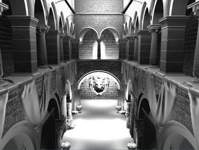

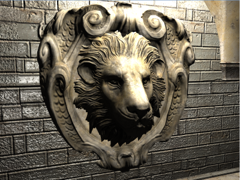

Here's the anti-aliasing in the path tracer screenshot:

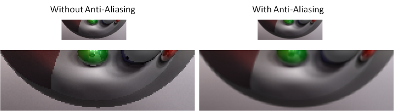

Wei-Chien also includes an image that cleanly highlights the implementation:

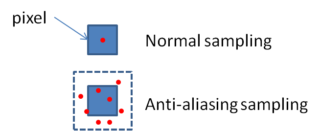

Recall that your audience is not me or the teaching assistant; it is technical hiring managers and developers.  It is useful to briefly explain the implementation given your broad audience.

Similar to side-by-side comparisions, it is also instructive to tweak key parameters and take multiple screenshots to show the effect of the parameter.  For example, here are two screenshots show depth of field in Wei-Chien's path tracer.  Both have a focal length of 10.  The first has an aperture radius of 0.2; the second is 0.5.  Note the clear difference in the area out of focus.

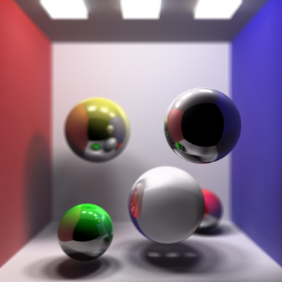

Again, to help a broad audience, Wei-Chien included some details and a screenshot on the algorithm itself:

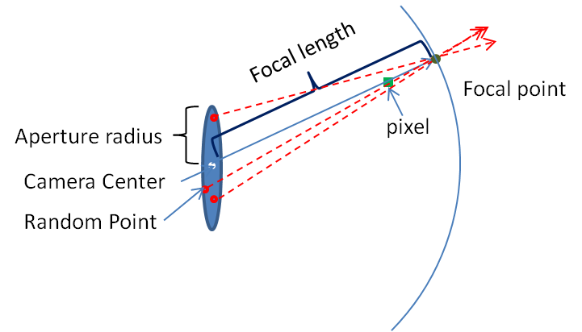

### TODO: bloopers

### TODO: videos and demos, link back.

### TODO: performance anaylsis

### TODO: focus on what is unique

More tips
---------

* Feel free to rename your fork of the starter-code repo.  For example, just because we named a repo `Project6-DeferredShader`, doesn't mean you have to.  Likewise, feel free to edit the description at the top of the repo page.
* Don't clutter the root directy with too many files because it will force visitors to have to scroll a lot to get to your `README.md`.
