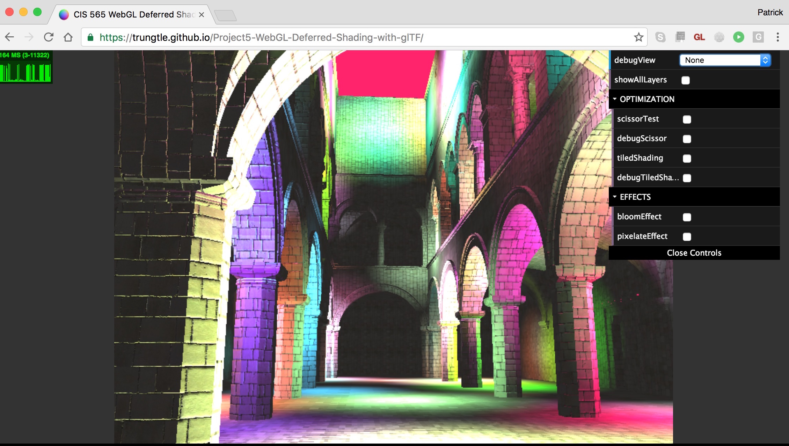
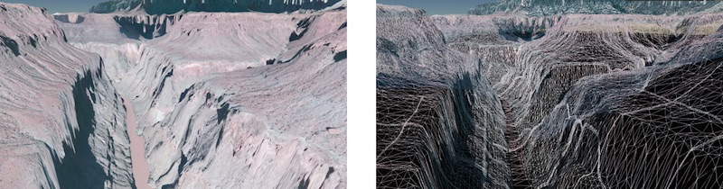
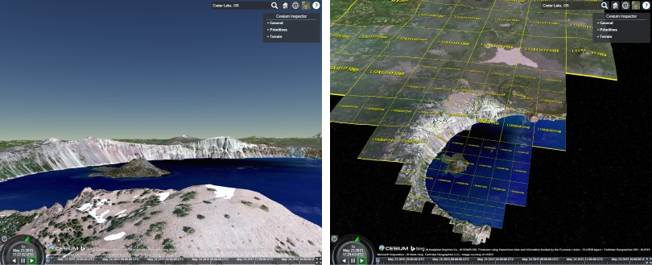
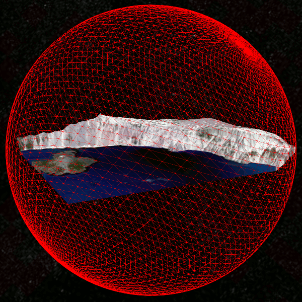
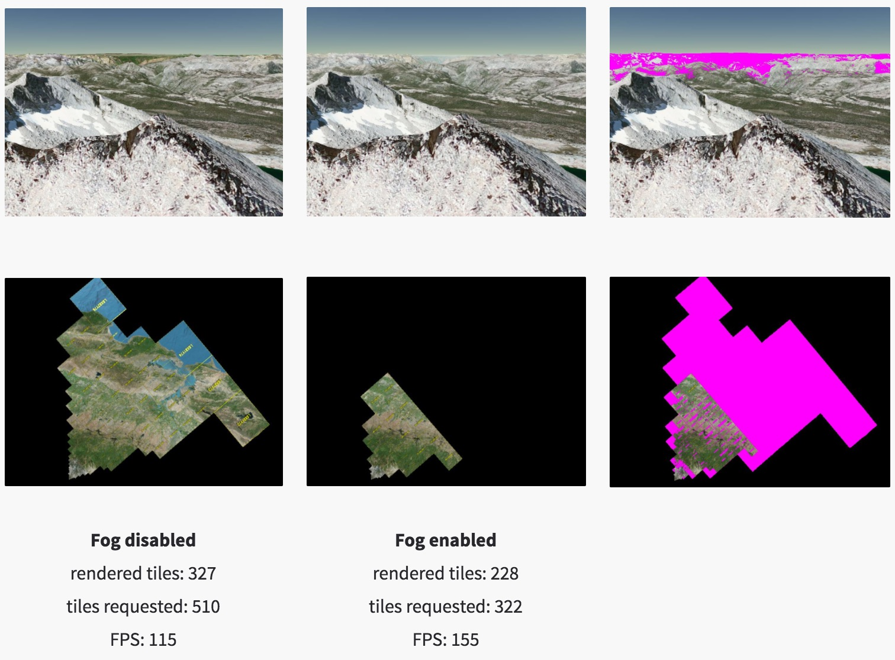

# Moving Graphics Research into Development

The [Penn graphics students](http://cg.cis.upenn.edu/index.html) I work with on MS thesis, senior design, and [GPU course](http://www.seas.upenn.edu/~cis565/) projects and my colleagues working on [Cesium](http://cesiumjs.org/) are all implementing fairly recent graphics research.

This article presents tips for implementing research that I have learned through hands-on development and through mentoring students and practitioners.  There seems to be a huge difference in productivity depending how how we navigate papers and how we approach implementing them.

Implementation is a great way to generate new ideas, but this article is not specifically about generating new research; it is about utilizing existing research to solve a particular problem.

## Finding Papers

A quick Google search usually provides prominent papers.  I also check Ke-Sen Huang's [website](http://kesen.realtimerendering.com/), which has papers from SIGGRAPH, I3D, Eurographics, and several other conferences.

Once you have a good paper, finding more is easy:
* Follow the references backwards to the seminal work.
* Go to each author's website and institute's website and check their publications.  For example, for point clouds, I like the work by [Enrico Gobbetti](http://www.crs4.it/vic/cgi-bin/people-page.cgi?name=%27enrico.gobbetti%27) at CRS4.
* Search for the paper on [Google Scholar](https://scholar.google.com/) and trace the most prominent papers that cite it.  Google Scholar is also useful for searching papers published in the past `n` years, which is great for culling old papers, e.g., CLOD terrain algorithms that are no longer appropriate for today's GPUs.
* Ask for recommended papers on twitter, seriously.

Quickly identifying and avoiding irrelevant papers is key to staying focused in the right direction.

## How to Read a Paper

### Skim it first

Assuming I have some understanding of the topic, it takes me about three hours to review an eight-page paper submission for a conference or journal.

When I'm not reviewing for a committee, and instead looking for papers on a particular topic, I don't read a paper that carefully on the first pass.  When I first started reading papers, I spent too much time reading papers that were tangential.  This lead to a lot of wasted time going down dead-end paths.

Instead, I suggest reviewing the figures and reading the Abstract, Introduction, and Results sections before dedicating time to a complete read.  Also check out the video or demo if available.  You may quickly find that the approach won't work for you because, for example, it is not fast enough for real-time, relies on features not supported by your target graphics API, relies on an expensive preprocess step, etc.  With that said, reading related though tangential papers, if you have the time, still generates potentially useful ideas.

### Understand the previous work

If the paper appears relevant, but I don't have the background to fully understand it, I try to find the seminal work reference in the Previous Work section and read it.  Google Scholar can help here since it will report how many times a paper was cited, a useful measure but not ground truth.  If you follow the preview work far enough, you may end up with a paper written in the 1970s or 80s, which are fun to read for their simplicity (by today's standards) and influence.  For example, enjoy [Particle Systems - A Technique for Modeling a Class of Fuzzy Objects](https://www.lri.fr/~mbl/ENS/IG2/devoir2/files/docs/fuzzyParticles.pdf), 1983, by William Reeves.

Survey papers and the Previous Work chapters in PhD/MS theses are also great places to look for background.  They distill down each relevant paper to its essence and give a framework for the subject.  For example, [A Developer's Survey of Polygonal Simplification Algorithms](http://www.cs.virginia.edu/~luebke/publications/pdf/cg+a.2001.pdf) (2001, David Luebke) and [Technical Strategies for Massive Model Visualization](http://sglab.kaist.ac.kr/~sungeui/paper/spm08_symp.pdf) (2008, Enrico Gobbetti, Dave Kasik, and Sung eui Yoon) lead to the bulk of the work I read for my MS thesis.

### Iterate

Once I've found a paper that I think I want to implement, I often need to read it - or at least parts of it - multiple times to gain a solid understanding.

I interleave reading with implementation.  Reading deepens my understanding to help me code, and coding deepens my understanding to help me read.

If you have the luxury of no other outside work, you might start the morning coding without even checking email, then check email after lunch, and then spend the afternoon reading so you have fresh ideas for coding the next morning.  You'll quickly have more ideas than time.  Choose carefully and keep a record of those not yet examined.  Often, when I go back at look at my notes, I am happy that I didn't spend time on many of the ideas that, in retrospect, would not have been as impactful.

### Reach out

Paper authors are often easily accessible via email or twitter.  Ask them a specific question that shows you've done your research, and they are likely to reply.  After all, they are interested in the same topic as you.  They know their work very well; one time, an author found a bug in our translucency implementation just by looking at a screenshot!

## How to Implement Research

The following advice applies to coding in general, but I think it is particularly relevant to implementing graphics research with non-trivial data structures and algorithms.

### Start small and iterate

Don't implement the whole paper at once.  Implement the smallest useful - or even not so useful - feature, verify that it works, and build on it, verifying the results each step of the way.  Get something working first, then make it fast and robust.

Verify, verify, verify.  Double check the code flow in the debugger, measure the performance early, and test with super simple scenarios before complex ones.  When the students in our GPU course implement a rasterizer, they start with a triangle model, then a box, and then the [COLLADA duck](https://github.com/KhronosGroup/glTF-Sample-Models/tree/master/1.0/Duck#duck).

Implementing an out-of-core spatial data structure?  Start with an in-core one.  Implementing a complex GPU algorithm?  Perhaps starting with a CPU implementation first is useful and gives us something to benchmark against.

As the code starts to stabilize, add unit tests.  For this type of work, I don't add unit tests too soon since they would break often.

### Report statistics

At the start, take the time to add code to report key statistics about the algorithm.

For example, in the out-of-core spatial data structures we use for streaming massive 3D models, we track the number of nodes in memory, nodes visited, nodes renderer, number of pending network requests, number of received requests that are processing, etc.

Watching these stats gives us a very quick indicator if things are working properly.  When I wrote the cache replacement algorithm to unload nodes from memory, I first added the relevant stats reporting so I could monitor them during development.  I also started with a super-simple test case with a cache size of 1 or 2 tiles.

### Test parameters

Also at the start, make it simple to tune key parameters.  If your using JavaScript, [dat.GUI](https://github.com/dataarts/dat.gui#datgui) makes it really easy to map a UI to variables.

Tuning parameters is great for understanding an algorithm, testing our implementation's robustness, and performance testing, e.g., quickly seeing how changing the number of dynamic lights impacts a deferred shading engine.

 
<a href="https://trungtle.github.io/Project5-WebGL-Deferred-Shading-with-glTF/">Renderer</a> with debug options to turn on/off different parts of the pipeline and debug views.

### Visualize everything

As graphics developers, we love to see the results of our code.  Debugging aids that visualize results are just as enjoyable, and can yield deeper insights and intuition. Some examples:
* bounding volumes
* wireframe
* g-buffers in a deferred shader
* tiles in a tile-based deferred shader
* freeze frame to review culling results
* shadow maps, including cascades

A couple of examples:

 
Left: Grand Canyon. Right: Wireframe showing skirts used to avoid cracks between tiles, how high frequency areas are more finely triangulated, and some sense of overdraw.

 
Left: View of Crater Lake (186 draw calls). Right: Freeze frame viewing tiles with their tile coordinates from a different perspective.  Images from <a href="http://cesiumjs.org/2015/05/26/Graphics-Tech-in-Cesium-Stack/">Graphics Tech in Cesium - The Graphics Stack</a>.

Sometimes a graphics API debugging tool such as [Renderdoc](https://renderdoc.org/builds) or [WebGL Inspector](https://benvanik.github.io/WebGL-Inspector/) is enough to review buffers, textures, shaders, etc.  I also find engine-specific tools useful since they are higher-level, e.g., they may color objects based on a shadow-map cascade, whereas a graphics API tool  may just show the shadow-map textures.  Time spent on and using tools always pays for itself in fewer bugs, deeper performance insights, and creating screenshots for documentation and even twitter.

Debug visualizations are useful because when we can visualize something, an insight often becomes obvious.  For example, look at how bad bounding spheres for Cesium's terrain tiles are [compared to oriented bounding boxes](http://cesiumjs.org/2015/06/24/Oriented-Bounding-Boxes/).

A visualization gives us an immediate sense, then our stats reporting gives precise numbers.  For example, note how the visualization below complements the statistics for [using fog to optimize terrain rendering](http://cesiumjs.org/2015/11/12/Fog/) by culling tiles in the far distant and increasing the geometric error for tiles in the mid-distance.

## Write

I thought I knew a lot about virtual globe rendering until I tried to coauthor a book about it; 520 pages later, I knew the topic much better and had lots of new ideas.  Whether it is a blog post, paper, or entire book, writing deepens our understanding and helps us generate new ideas.  It also helps the field move forward as we build on each other's work. 
